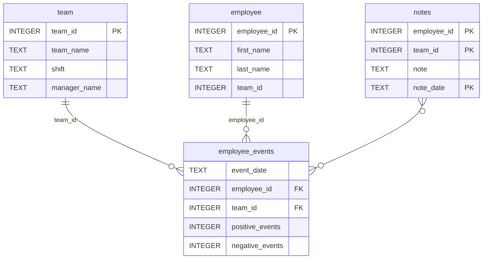

# Software Engineering for Data Scientists 

This repository contains starter code for the **Software Engineering for Data Scientists** final project. Please reference your course materials for documentation on this repository's structure and important files. Happy coding!

### Repository Structure
```
├── README.md
├── assets
│   ├── model.pkl
│   └── report.css
├── env
├── python-package
│   ├── employee_events
│   │   ├── __init__.py
│   │   ├── employee.py
│   │   ├── employee_events.db
│   │   ├── query_base.py
│   │   ├── sql_execution.py
│   │   └── team.py
│   ├── requirements.txt
│   ├── setup.py
├── report
│   ├── base_components
│   │   ├── __init__.py
│   │   ├── base_component.py
│   │   ├── data_table.py
│   │   ├── dropdown.py
│   │   ├── matplotlib_viz.py
│   │   └── radio.py
│   ├── combined_components
│   │   ├── __init__.py
│   │   ├── combined_component.py
│   │   └── form_group.py
│   ├── dashboard.py
│   └── utils.py
├── requirements.txt
├── start
├── tests
    └── test_employee_events.py
```

### employee_events.db



## How to set up this project 🛠️

### Step 1: Install the Python Package
```bash
cd python-package
pip install -e .
```

### Step 2: Install Dependencies
```bash
pip install -r requirements.txt
```

### Step 3: Run Tests
```bash
pytest tests/
```

### Step 4: Start the Dashboard
```bash
cd report
python dashboard.py
```

Then visit http://localhost:5001 in your web browser!

## Project Objective

The objective of this project is to provide a robust, modular, and extensible dashboard for data scientists to analyze employee and team event data. The dashboard enables users to visualize key metrics, monitor recruitment risk, and explore employee and team notes, supporting data-driven decision-making in HR and operations.

## Features

- **Interactive Dashboard:** Visualize employee and team event data with dynamic charts and tables.
- **Employee & Team Profiles:** View detailed information and event history for individual employees and teams.
- **Recruitment Risk Prediction:** Integrated machine learning model to predict recruitment risk for employees and teams.
- **Notes Management:** Access and review notes associated with employees and teams, including historical context.
- **Modular Component Architecture:** Easily extend or customize dashboard components for new data or visualizations.
- **SQL-backed Data Access:** Efficiently query and aggregate data from a normalized SQLite database.
- **Test Suite:** Automated tests to ensure code quality and correctness.
